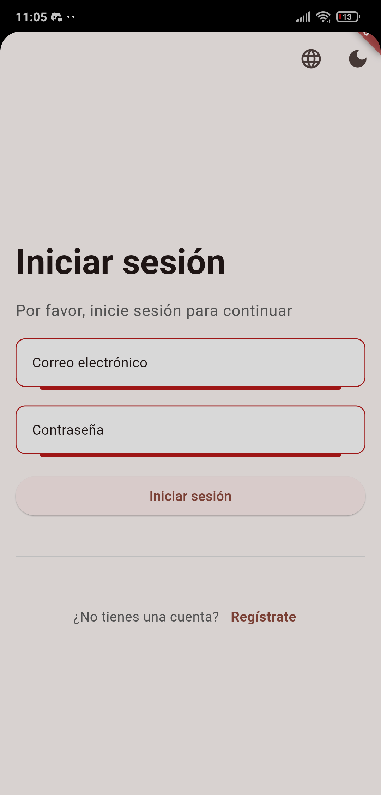
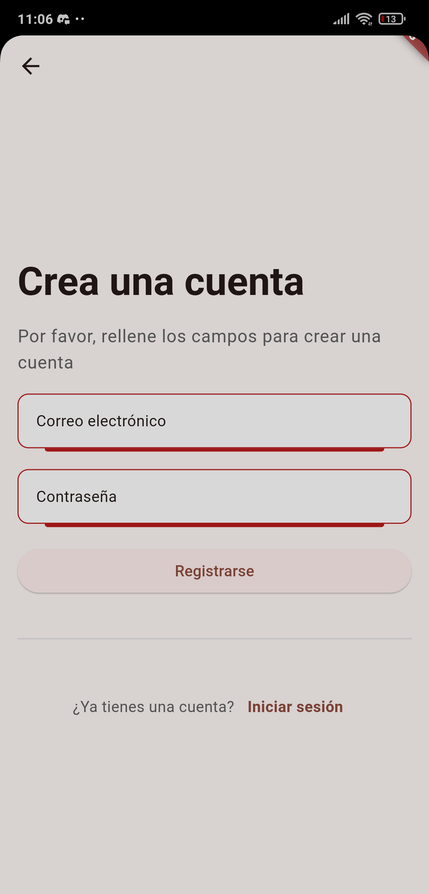
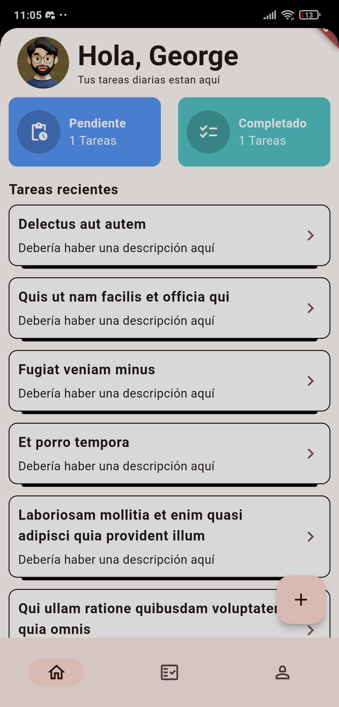
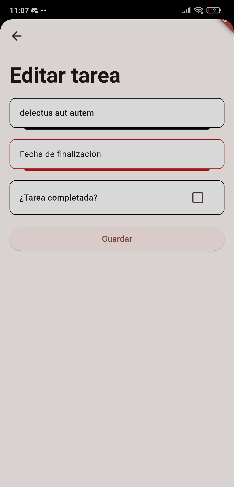
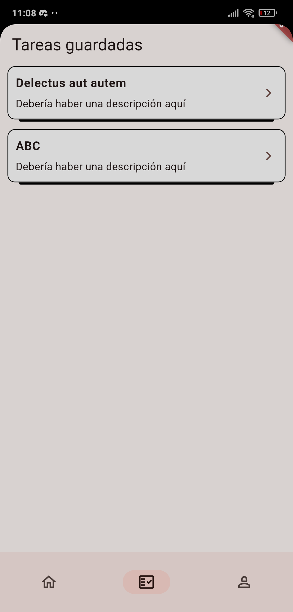
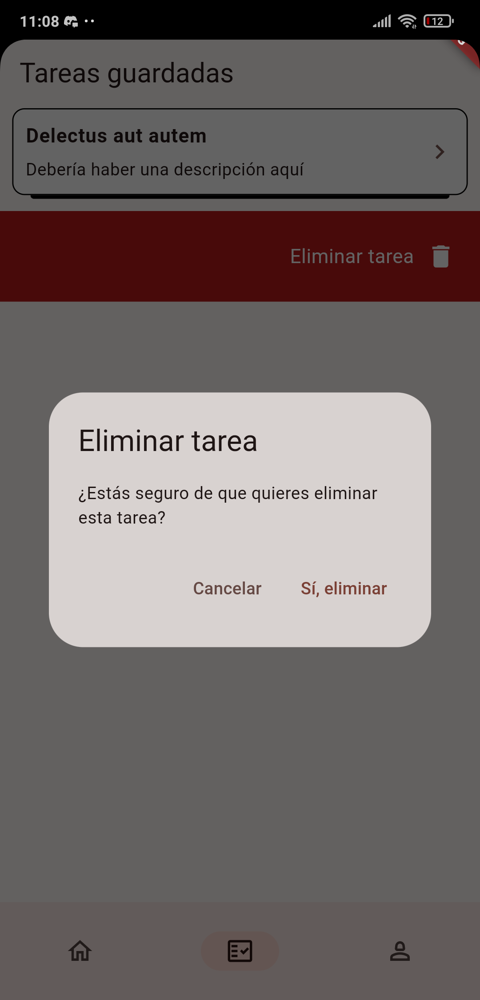
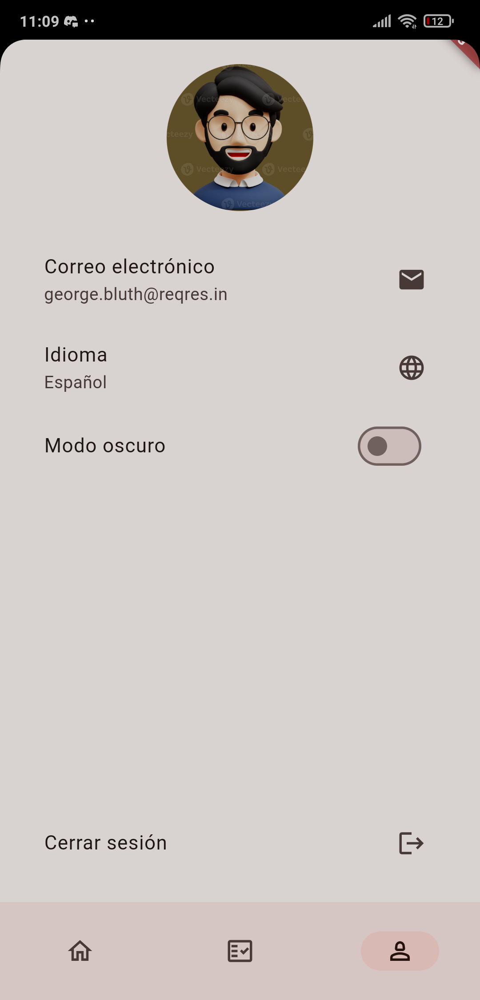
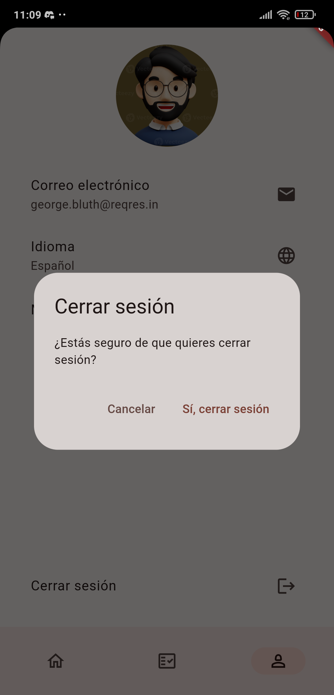
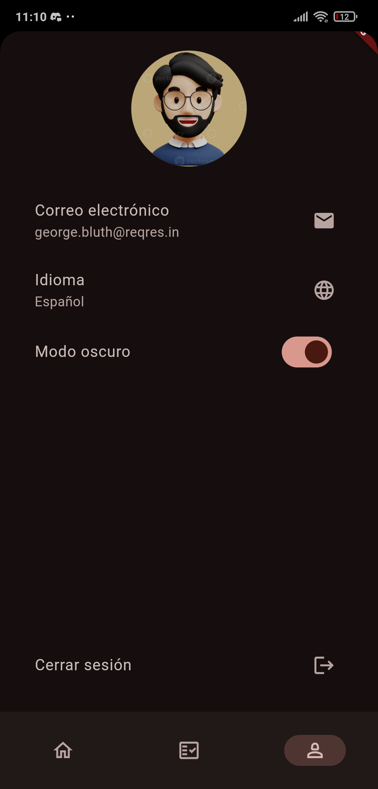
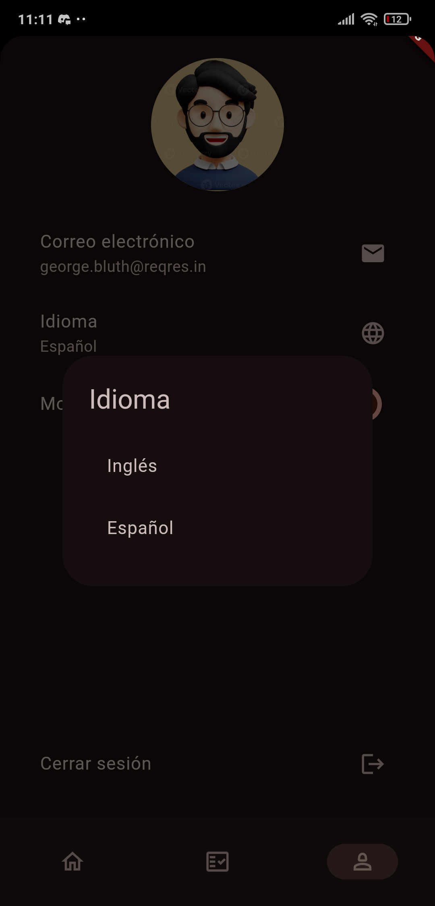

# App Test

A Flutter project for demonstrating an application using ReqRes and JSONPlaceholder API.

## Getting Started

### Prerequisites

- Flutter (version 3.0.0 or higher)
- Dart
- Android Studio or Xcode for iOS development

### Installation

1. Clone the repository:
   git clone https://github.com/bryanjorgeflores/fulltimeforce_test.git
   cd fulltimeforce_test

2. Get the dependencies:
   flutter pub get

3. Run the application:
   flutter run

### Generating IPA and APK

The IPA and APK files are generated in a folder called `Generated`.

## Technical Decisions

### Packages

- flutter_bloc: Used for state management. It helps in managing the state of the application in a predictable way.
- sqflite: Used for local database storage.
- path_provider: Used to find commonly used locations on the filesystem.
- dio: Used for making HTTP requests. It provides powerful features like interceptors, global configuration, and more.

### Architectural Patterns

- BLoC (Business Logic Component): Chosen for state management to separate business logic from UI. This makes the code more modular, testable, and reusable.
- Repository Pattern: Used to abstract the data layer, making it easier to manage data from different sources (e.g., network, local database).

### Methodologies

- Clean Architecture: Applied to ensure separation of concerns, making the codebase more maintainable and scalable.

## Additional Functionalities

- Login: Allows users to log in to the application.
- Register: Provides a form for users to create a new account.
- Main Page: Displays a summary of tasks and a list of recent tasks.
- Saved Tasks: Allows users to view all saved tasks and provides options to delete or edit a saved task.
- Settings: Provides options to change the language, toggle dark mode, and log out.

## Screenshots

| Login | Register |
|-------------|-----------------|
|  |  |

| Home | Edit Task |
|----------------|-----------|
|  |  |

| Saved Tasks | Delete Task |
|----------------|-----------|
|  |  |

| Profile | Logout |
|----------------|-----------|
|  |  |

| Dark Mode | Change Language |
|----------------|-----------|
|  |  |

